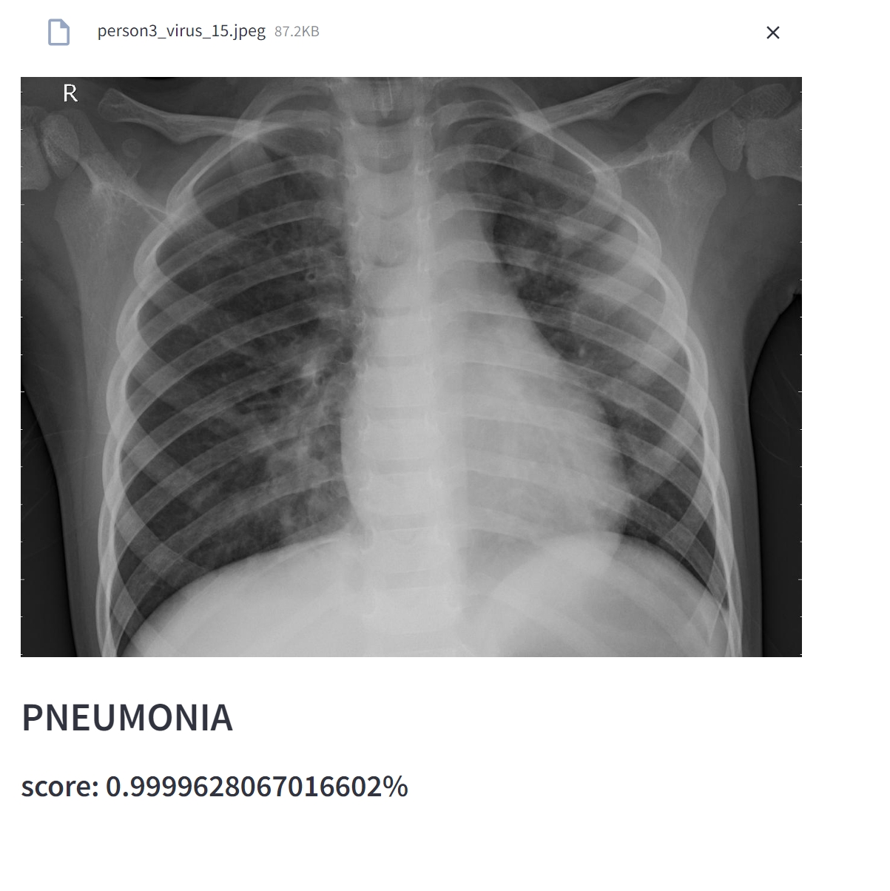

# Pneumonia Chest X-ray Image Classification (Computer Vision)
**The objective of this Comp Vis github project is showcase a deployed web application using streamlit as front-facing interface whereby users can upload chest x-rays to check for the presence of pneumonia using Image Classification Computer Vision. It is a very practical, straightforward deep learning application that aims to reduce manual and tedious scanning of x-rays. That said, the primary aim is to showcase the deployment, modelling architectures and approaches, evaluation metrics, model saving and loading for inference, visualisations of evaluation metrics. The model can still be further improved to target different distribution of the sets and imbalanced classes.**

## Screenshot of the Web Application

## Scoring Metric Choice
**f1 score** is utilised as the scoring metric since from the Exploratory Data Analysis, the labels are hugely balanced. It is evident that the data is skewed heavily to the pneumonia classification label. However, it is evident from the plots that the class distribution is widely different between the train and validation datasets as compared to the test dataset. **Accuracy score** is also added as an extra evaluation metric though greater emphasis should be placed on the f1 score

## Modelling Approaches 
**Simple and basic Exploratory Data Analysis** is performed to have a better understanding of the images in the dataset. 

**Target Distributions** are widely skewed and the train + valid datasets distributions are different from the test dataset distribution, worsening the data/concept drift.

**-------Model Architecture Approaches--------**

1. **Custom 1 block VGGnet - Custom 3 block VGGNet**
A 1 block vggnet was implemented as it is a straightforward conv net model to apply and trial before considering the use of more complicated models. The blocks have been expanded to a 3 block architecture since the goal is to first increase the complexity of the model (allowing some overfitting to occur first), before implementing regularisation techniques, such as batchnorm2d or spatial dropout 2d (more suited for convnets). The f1 score and accuracy score of the 3 block VGGnet is slightly lower than the one-block, but it was chosen as from the plots and the score, the overfitting seems to be lower compared to the 1 block VGGNet.

As such, **batchnorm2d** was introduced as it has implicit regularisation effects by injecting "noise" additively or multiplicatively during the standardisation process. **Spatial Dropout2d (for conv layers) was not implemented** as it is advised against to include both batchnorm2d and dropout together, since there can be disharmony in the variance shift when using them together. (When dropout remove some neurons, a bad estimate of mean and variacne for the activation is obtained). Validation f1 score had actually improved from introducing batchnorm2d.

**Data Augmentation** is thus performed to introduce transformations to the original images so that the model can learn from more varied images and generalize better. This helps to reduce the overfitting. The **transformations introduced are intended to be modest and practical** as extreme transformations are not meaningful to the model. **No transformations are performed on the validation set** to prevent introducing randomness during evaluation. **Online data transformation is performed since images are newly transformed at each and every iteration compared to a fixed offline data augmentation** that also increases disk space. However, as the data augmentation is too modest or inappropriate, there was instead a decrease in performance with more overfitting. Probably for x-rays, the space to augment data is limited to sharpness, slightly shifting horizontally or vertically, but flips, extreme rotations would not be appropriate logically.

2. **Custom 2 block ResNet - Custom 3 Block Resnet**
A custom 2 block and 3 block ResNet was implemented as it is one of the more popular cnn architecture with good performance. Unfortunately, the resnets overfitted very quickly with training accuracy hitting very closely to one. As such, some dropouts at the fully connected layers and spatial dropout 2d was introduced at the residual blocks. However, some overfitting was still present evidently, with validation f1 score dropping.

Pre-trained ResNet-18 that was fine-tuned on the last fully connected layer had quite a good score with no overfitting present. It can be a viable model for deployment. Actually, more layers can be fine-tuned instead of fine-tuning only the fully-connected layer. However, due to time limitaitons and computational cost, this was not trialled.

**Deep Conv layers with regularisation and Deep Conv Layers with regularisation + recommended placement of batchnorm and spatial dropout**
1. Deep Conv layers with regularisation 
A deep conv layer was trialled to experiment how deeper layers would perform for this given task. Regularisation such as dropout, spatial dropout 2d (feature maps) were implemented to address the overfitting that we had seen in the previous model architectures. However, it appears that overfitting is still present.

2. Deep Conv layer with recommended placement of batchnorm2d and spatial dropout layers.
Spatial dropout and batchnorm2d should not be placed closely together since covariance shift can affect the model differently during train time and inference time. As such, batchnorm2d would usually be placed first before spatial dropouts. This model has reduced overfitting compared to 1., suggesting that the placement does really affect the model's performance at times.

**Selected model**
VGGNet 3 with batchnorm was selected as the f1 score is one of the highest, though slightly lower than the Resnet models. However, as it has very low overfitting, it was selected in preference compared to the resnet models.

**Selected Model performance on the test set**
The performance of the final model on the test set can be slightly shocking as the performance is vastly different compared to the validation performance, especially when f1 score and stratified k fold was used for the models. However, it is also known that the dataset distributions are greatly different between the test set and (train set + validation set). A confusion matrix was plotted for the inference on the test set for better visualisation and to glimpse a better understanding of what could be contributing to the problem. It can be observed that the model is usually wrong when it **predicts pneumonia for normal cases**. This could be attributed to the model being trained on a greatly imbalanced dataset with very high proportion of pneumonia cases, while the test set has a greater proportion of normal cases.

**Mitigations**
1. Since the labels are assigned using the argmax function on the softmax probabilities, we can tweak the threshold score for the model to be very certain that it is a pneumonia case before predicting it is one. This will help to deccrease the skewed classification of pneumonia cases.

2. **Offline data augmentation (Recommended)** can be perforemd to increase the proprotion of normal datasets so that the dataset is more balanced. Having a balanced dataset can be more appropriate for the model to learn whether the x-ray shows pneumonia or not, rather than having the model learn to always predict just an individual class. (which would not be learning much). The data augmentation should not contain any flips or rotations. More importantly, a horizontal shift or a slight vertical shift can be a better choice since an x-ray is always centralised. However, if we shift/translate it by just a bit, it is technically creating a new image that is logical and practical. 